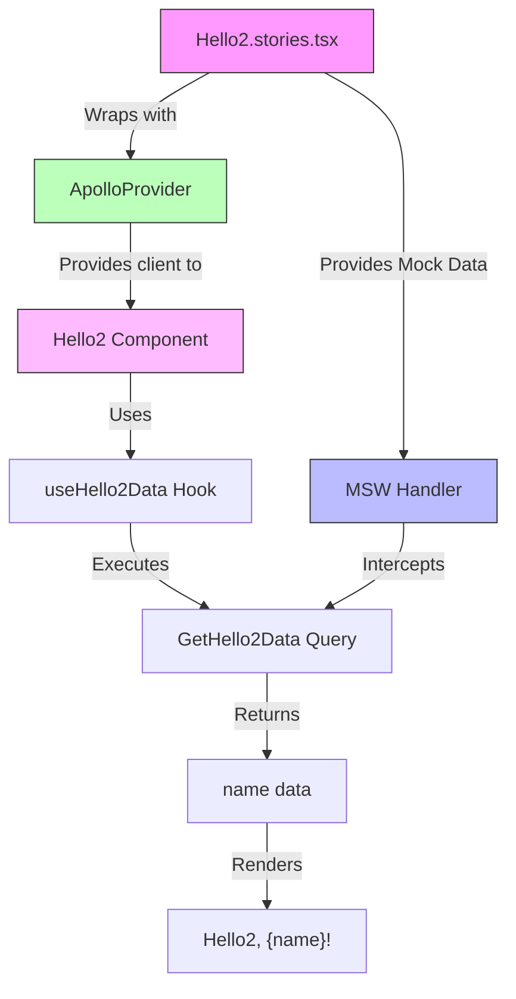
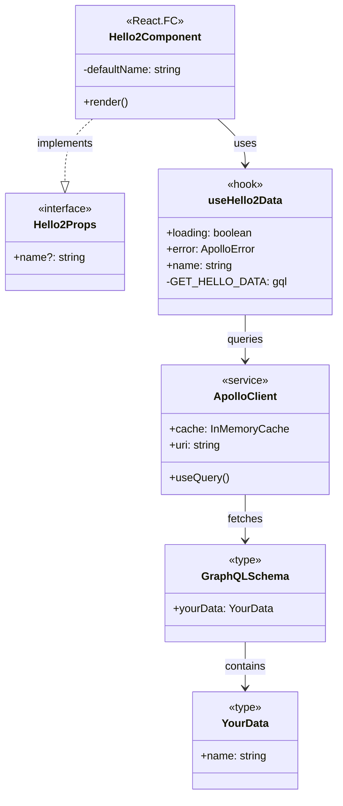
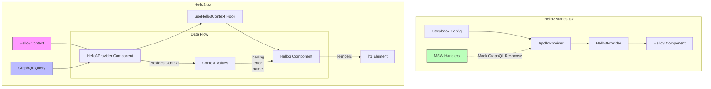
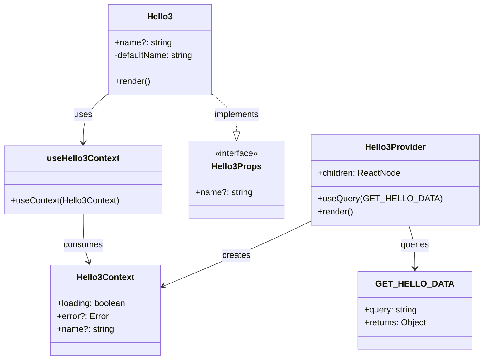

# Description

A basic app that shows how to use msw with graphql in a React app.

## Steps

``` {.bash org-language="sh"}
npx create-next-app next-msw-graphql-app

cd next-msw-graphql-app
pnpm i -D msw msw-storybook-addon @storybook/react
pnpm i graphql @apollo/client

npx storybook@latest init
npx msw init ./public
```

## Usage Patterns

### Pattern 1: Component-level Query

-   see Hello.tsx, Hello.stories.tsx
-   The data is only needed by this component
-   The query is simple
-   You don't need to share the data with other components

### Pattern 2: Custom Hook

-   see Hello2.tsx, Hello2.stories.tsx
-   Reuse the query logic across multiple components
-   Separate data fetching concerns
-   Add additional data transformation logic





### Pattern 3: Context Provider

-   see Hello3.tsx, Hello3.stories.tsx
-   The data needs to be shared across many components
-   You want to avoid prop drilling
-   You need to manage global state





